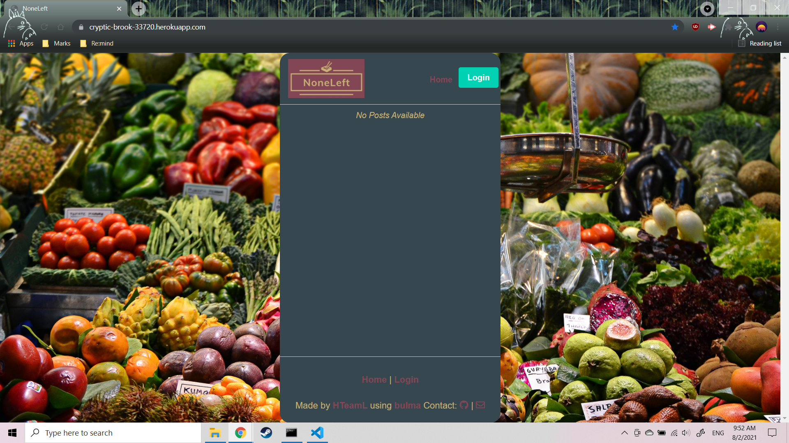

# NoneLeft

## Description
NoneLeft allows the user to refer to a database full of ways to reuse the food leftover from various meals. The user is also able to login, add, and delete comments as well as leave a scored review of the tastiness of the re-made meals.

## Technologies Used
- Handlebars
- Node.js & Express.js
- MySQL & Sequelize
- Heroku
- Bulma

## Screenshot

## Website
https://cryptic-brook-33720.herokuapp.com/

## Contributors
- Newton Armstrong
- Asher Bergtraun
- Thomas Walker